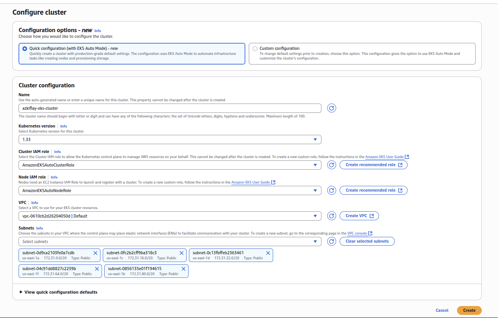
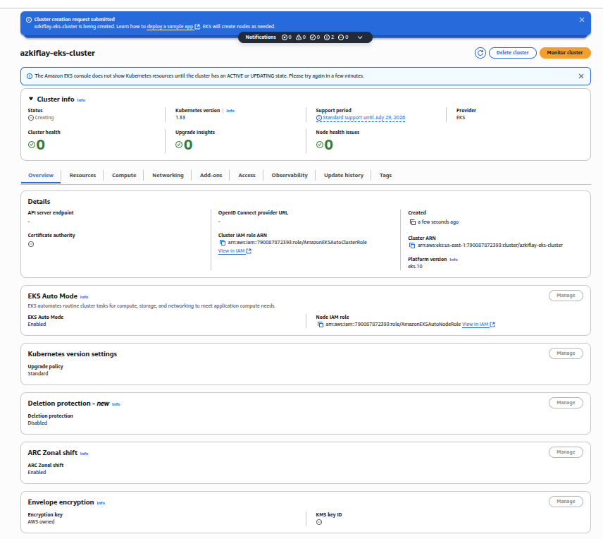

**Contents**
- [Introduction](#introduction)
- [Components of Kubernetes](#components-of-kubernetes)
- [Application Deployment in Kubernetes](#application-deployment-in-kubernetes)
- [Features of Kubernetes](#features-of-kubernetes)
- [Tools and Terminology](#tools-and-terminology)
- [Manged Kubernetes Services](#manged-kubernetes-services)
- [Amazon Elastic Kubernetes Service (EKS)](#amazon-elastic-kubernetes-service-eks)
  - [EKS Architecture](#eks-architecture)
- [Creating EKS Cluster](#creating-eks-cluster)
  - [IAM user for EKS](#iam-user-for-eks)
  - [EKS with AWS Console](#eks-with-aws-console)
  - [EKS with eksctl](#eks-with-eksctl)
  - [EKS with Terraform](#eks-with-terraform)
- [Deploying Applications on EKS Cluster](#deploying-applications-on-eks-cluster)
  - [Creating an EKS Cluster](#creating-an-eks-cluster)
  - [Pods](#pods)
  - [Creating a Deployment](#creating-a-deployment)
  - [Service Objects to Expose Applications](#service-objects-to-expose-applications)
- [References](#references)
# Introduction
Multiple Operating Systems (OSes) are able to run on a single server through virtualization solutions such as VMware, Xen, VirtualBox. Containerization tools (e.g., Docker) took hardware-level virtualization to the next level. Because containers provide OS-level virtualization, making application that run in containers to be self-contained. However, while containers solve problems, including package conflict and dependency, managing several containerized applications is not easy. While containers make it possible to deploy applications easily, managing so many of them created difficult. That's the where the need for container orchestration comes in, to create, deploy and manage thousands of containers. 

For example, [Docker Swam](https://docs.docker.com/engine/swarm/) is a container orchestration platform for Docker containers. Notably, [Kubernetes](https://kubernetes.io/) is one of the most widely used container orchestration platforms. Generally, there two planes in controller orchestration: **control plan** and **worker plane**. An orchestrator, e.g., K8s, sits at the *control plane*, while containers, referred to as **worker nodes**, form the *worker plane*. While containerized applications are actually run on the worker nodes, the controller administers them. 

Kubernetes automates the deployment and management of containerized applications. It is an [open-source](https://github.com/kubernetes/kubernetes) software that has been widely used in cloud-native applications. Although originally developed by Google, Kubernetes is used across cloud service providers. Kubernetes is also referred to as **K8s** where the number 8 represents the number of characters between 'K' and 's' in the full name. K8s, pronounced as "*Kates*", is the de facto platform for cloud-based container workloads.

# Components of Kubernetes
<!-- K8s is an OS for a cluster of computers.-->
- K8s provides the following services to applications:
  - **service discovery**: finding and accessing other applications' services
  - **load balancing**: sharing load among instances of the application.
  - **self-healing**: K8s restarts failed application copies
  - **leader election**: K8s decides which application copy is active at a given moment.
  - **horizontal scaling**: creating new containerized copies of the application.
- Computers in a K8s cluster belong to either **control plane** or **worker plane**. The control plane consists of master nodes that control the cluster. For production, at least **three** master nodes to achieve high availability. Worker plane is composed of computers, known as worker nodes, where actual applications are deployed. The number of nodes in the worker plane can vary depending on the use case, but the size of the applications deployed through the K8s API should the worker nodes. For the user, K8s makes all worker nodes a single deployment surface. To manage the deployed application on them, worker nodes also run K8s components, which communicate with the K8s master nodes.
- **Control Plane**:
  - **Scheduler**: assigns worker nodes the application instances each has to run.
  - **Controllers**: Create objects based on configuration defined by users.
  - **K8s API Server**: provides access to the cluster using RESTful API.
  - **etcd**: *persistent* data store for the API server, which has exclusive access to *etcd*. Although the API server is stateless, *etcd* persists objects created by the former.
- **Worker Plane**: 
  - **Kubelet**: It is an agent that communicates with the K8s API server. Kubelet manages worker nodes and containers that run on them.
  - **Container Runtime**: Docker or other K8s-compatible container. It runs applications according to instructions it receives from the Kubelet. It also sends status reports to Kublet.
  - **Kube Proxy**: Network traffic load balancer for deployed applications. Kube Proxy connects the Worker Plane to the API Server in the Control Plane.
  - Each worker has Kublet, Kube Proxy, Container Runtime, and optionally **Logging Agent**, **Network Plugin**, and **DNS Server**.

# Application Deployment in Kubernetes
- An application is deployed in K8s by creating various objects defined using **manifest files** in Yet Another Markup Language (**YAML**) or JavaScript Object Notation (**JSON**).
- User submits (e.g., using *kubectl**) an application manifest file to K8s API.
- K8s API Server saves the objects defined int he manifest file to **etcd** for persistence.
- The controller creates the objects in the manifest. It can create more than one objects if replicas are specified.
- The scheduler allocates nodes to application instances.
- At the worker node, the Kublet detects the Scheduler assigned an instance to the node. The, the Kublet instructs the container runtime to run the application.
- The Kube Proxy creates a load balancer for the application instances. It assigns a single IP address to expose the applications for external access.
- Kublet and Kublet Pxoy are types of controllers at the worker node level.
- The applications are monitored by the Kublets and the Controllers, maintaining the desired state as defined in the manifest file.


# Features of Kubernetes
- **Abstraction of Infrastructure**: Users and application do not have to worry about specifics of hardware and network, as those are managed by K8s.
- **Standardized Deployment**: K8s enables application deployment across various cloud and on-premises environments using the same configuration file. Moreover, most cloud providers have adopted K8s, making it easy for users to deploy their application across hybrid-cloud infrastructure. Due to the wide adoption of K8s, users need not worry about compatibility or vendor lock-in. Because K8s APIs work across cloud service providers. Therefore, users do not necessarily have to deploy and manage their applications using proprietary APIs. Instead, they can use K8s APIs, which can transfer easily across major cloud providers such as Google Cloud, IBM Cloud, Microsoft Azure, and Amazon AWS.
- **Declarative Deployment**: K8s utilizes declarative model to create and monitor the health status of application components. When configuration of the deployed components is changed, K8s automatically achieves the desired state according to the new declaration. This includes changes made on purpose or when some component fails. In the latter, since K8s continuously takes actions so that the configuration of the desired state matches the actual state. If not, K8s takes necessary actions to remedy any failing or missing component. Consequently, K8s is a self-healing online system.
- **Application Management**: Once and application is deployed on it, K8s takes over its management without any manual involvement from users.
- **Application Scalability**: Due to its use of declarative configuration and immutable containers, K8s can easily scale up and down resources for applications deployed on it.
- **Microservice Management**: K8s automates the communication between microservices that are deployed across the infrastructure. 
- **Support for Devops**: As the infrastructure are abstracted by K8s, development and operations teams collaborate more easily. Moreover, K8s enables deployment of application by developers, minimizing their reliance on system administrators.

# Tools and Terminology
* **Namespace**: an isolation and access control mechanism.
* **Pod**: a number of containers that have the same Linux *namespace*, *cgroups*, *storage* and *network* resources.
* **Service**:
* **Ingress**: A fronted exposed that can be accessed outside a K8s cluster.
* [**kubectl**](https://kubernetes.io/docs/tasks/tools/): is a command line tool for managing Kubernetes objects (e.g., Pods, Services, ReplicaSets)
* 
# Manged Kubernetes Services
Kubernetes is an open-source system, giving rise to a number of service providers. While it is possible to deploy and run all Kubernetes components from scratch in ones own infratructure, it is usually better to leverage existing Kubernetes cloud service provisions. Some of the dominant managed kubernetes service providers include [**Red Hat OpenShift**](https://www.redhat.com/en/technologies/cloud-computing/openshift), [**Rancher**](https://www.rancher.com/), [**Google Kubernetes Engine (GKE)**](https://cloud.google.com/kubernetes-engine?hl=en), [**Azure Kubernetes Service (AKS)**](https://azure.microsoft.com/en-us/products/kubernetes-service), and [**Amazon Elastic Kubernetes Service (EKS)**](https://aws.amazon.com/eks/). The focus of this tutorial is on Amazon's **EKS**.

<!--
## Creating Google Kubernetes Engine (GKE)
GKE is a managed K8s service provided by Google. Unlike self-managed K8s, GKE provides cluster nodes that are ready for deploying your applications. You can take the following steps to set up your GKE.
- Create a Google account or use an existing one.
- Sign up for a trial GKE service [here](https://cloud.google.com/kubernetes-engine?hl=en).
- Install [**gcloud CLI**](https://cloud.google.com/sdk/docs/install#deb) for your platform.
  ```bash
    sudo apt-get update
    sudo apt-get install apt-transport-https ca-certificates gnupg curl # apt-transport-https, curl
    curl https://packages.cloud.google.com/apt/doc/apt-key.gpg | sudo gpg --dearmor -o /usr/share/keyrings/cloud.google.gpg # Import the Google Cloud public key
    echo "deb [signed-by=/usr/share/keyrings/cloud.google.gpg] https://packages.cloud.google.com/apt cloud-sdk main" | sudo tee -a /etc/apt/sources.list.d/google-cloud-sdk.list # Add the gcloud CLI distribution URI as a package source
    sudo apt-get update && sudo apt-get install google-cloud-cli # Update and install the gcloud CLI
    gcloud init # To authenticate sign in to Google Cloud SDK
    gcloud components update # To upgrade
    ```
- Running **gcloud init** will prompt you to create a new project or use an existing one.
- To create a Kubernetes cluster on GKE, use **glcoud** as shown below.
  ```bash
    gcloud config set compute/zone europe-west2-c # Configure default zone. Check https://cloud.google.com/compute/docs/regions-zones
  ```
-->

# Amazon Elastic Kubernetes Service (EKS)
<!-- # Note: EKS is not part of AWS free tier. EKS costs $0.10 per cluster per hour. So, resorting to **minikube** local Kubernetes with one controller node. Advanced concepts can be tried later on EKS for a fixed hour and with a clear execution plan, having mastered K8s skills on Minikube first. -->

- EKS is a managed Kubernetes service provided by Amazon. It is usually a better alternative to self-managed K8s cluster. Of course, there are other similar solutions from other providers such as Microsoft, Google, and Red Hat.
- On Amazon AWS, EKS is used to deploy and manage K8s clusters.
- Using EKS, you can spend more time on your specific use case rather than on installing and maintaining K8s.
- EKS is a managed service that is used to run containerized applications. It reduces complexities of *networking*, *security*, *storage*, *scaling*, *load balancing*, and *observability*, and integration with other AWS services.
- In EKS, Amazon provides the control plane of the K8s, and the user attaches worker nodes to it. Users can use worker nodes from AWS or attach their own self-managed worker nodes.
- Pre-requisite: AWS account, familiarity with Linux, Python, Terraform, YAML
- Tools and Interfaces: AWS CLI, **eksctl**, AWS CDK, Terraform, AWS Console, Helm
- EKS AMI images

## EKS Architecture
While K8s is a container orchestrator, EKS is an orchestrator for K8s clusters. There are two planes in K8s: the control plane and the worker plane. In EKS, AWS manages the K8s control plane, which is composed of K8s and AWS components. These include the **controller manager**, **API server**, **scheduler**, and **etcd** database. In contrast, the worker plane is administered by an EKS user. The worker plane is created within an AWS virtual private cloud (VPC) network. To enable communication between the K8s control and worker planes, EKS utilizes AWS-managed VPC network.
The control plane includes the following: </br>
- **API Sever**: provides access gateway for all user and service requests from inside and outside the cluster.
- **Controller Manager**: maintains the desired state of cluster objects through controllers for nodes, replica, endpoint, and so on.
- **etcd**: datastore for key-value pairs and other metadata to keep EKS clusters in a desired state.
- **Scheduler**: assigns workloads to nodes.
The EKS worker plane includes the following: </br>
- **VPC**: network infrastructure managed by the user to deploy worker plane resources. Worker nodes inside the VPC run the pods in the cluster.
- **Cluster Security Group**: virtual firewall to control traffic between the control plane and worker plane.
  
# Creating EKS Cluster
EKS clusters can be created and managed using Terraform, AWS Console, AWS CLI, eksctl. While Terraform is an Infrastructure as Code (IaC) tool that can be used across multiple cloud service providers, the other tools are tools specific to Amazon.
## IAM user for EKS 
To create and manage your EKS clusters, you need to create an IAM user with relevant permissions. One way to do that easily is to create an administrator account on AWS Console as shown in Figure 1 below.
    <p align="left">
    
    </p>
    <p align="left"><strong>Figure 1:</strong> Creating IAM user for EKS administration </p>

## EKS with AWS Console
You can create your EKS cluster using the AWS management console. There are required fields that need to be populated for the EKS cluster to be created using the AWS console.

- First, create Cluster IAM role and Node IAM role as shown in Figure 3.
<figure>
  <table>
    <tr>
      <td>
        
      </td>
      <td>
        
      </td>
    </tr>
  </table>
  <figcaption><strong>Figure 3: </strong> Creating Cluster IAM and Node IAM roles </figcaption>
  </figure>

Figure 4 shows the various fields that need to be filled to create Amazon EKS using the AWS console.
  <figure>
  <table>
    <tr>
      <td>
        
      </td>
      <td>
        
      </td>
    </tr>
  </table>
  <figcaption><strong>Figure 4: </strong> Creating an EKS cluster using the AWS console </figcaption>
  </figure>

After clicking "**Create**", it takes a few minutes until the EKS cluster is ready. Figure 5 shows the progress and final state of the EKS cluster. When the value of the *Status* column is **Active**, the EKS cluster is ready for application deployment.
  <figure>
  <table>
    <tr>
      <td>
        
      </td>
      <td>
        
      </td>
    </tr>
  </table>
  <figcaption><strong>Figure 5: </strong> Creating an EKS cluster using the AWS console </figcaption>
  </figure>

AFter creating the cluster, its configuration and status can be monitored using the AWS console. Figure 6 and 7 show various tabs that show details of the EKS cluster.
  <figure>
  <table>
    <tr>
      <td>
        
      </td>
      <td>
        
      </td>
    </tr>
  </table>
  <figcaption><strong>Figure 6: </strong> EKS cluster details - part 1 </figcaption>
  </figure>

  <figure>
  <table>
    <tr>
      <td>
        
      </td>
      <td>
        
      </td>
    </tr>
  </table>
  <figcaption><strong>Figure 6: </strong> EKS cluster details - part 2 </figcaption>
  </figure>

Finally, it is important to **delete the cluster** if it is not for production purposes, as is the case here. Otherwise, keeping the EKS cluster running will result in monetary charges to the AWS account holder. Moreover, there AWS account will be charged for the amount of time the EKS cluster was running until deletion according to Amazon's hourly rate for the EKS service.

## EKS with eksctl
Another way to create, deploy and manage EKS cluster is to use Amazon's own open-source [**eksctl**](https://github.com/eksctl-io/eksctl) tool. Unlike other IaC tools such as Terraform, eksctl can be used for EKS clusters, but not other Kubernetes services from other providers. Therefore, **eksctl** may not be the right tool for your based on the type of infrastructure you work with. For example, if you have hybrid-cloud infrastructure, vendor-agnostic tools such as Terraform are likely to fulfil your needs better. However, for AWS-based infrastructure environment *eksctl* can be used to create and administer EKS clusters.

* Install and configure [AWS CLI](https://docs.aws.amazon.com/eks/latest/userguide/install-awscli.html)
  ```bash
    aws configure --profile edom # Configure access keys and region
    export AWS_PROFILE=edom # Set default user
  ```
* Install [eksctl](https://eksctl.io/installation/) and [kubectl](https://docs.aws.amazon.com/eks/latest/userguide/install-kubectl.html)
    ```bash
      ARCH=amd64 # for ARM systems, set ARCH to: `arm64`, `armv6` or `armv7`
      PLATFORM=$(uname -s)_$ARCH
      curl -sLO "https://github.com/eksctl-io/eksctl/releases/latest/download/eksctl_$PLATFORM.tar.gz"
      # Verify checksum
      curl -sL "https://github.com/eksctl-io/eksctl/releases/latest/download/eksctl_checksums.txt" | grep $PLATFORM | sha256sum --check
      tar -xzf eksctl_$PLATFORM.tar.gz -C /tmp && rm eksctl_$PLATFORM.tar.gz
      sudo install -m 0755 /tmp/eksctl /usr/local/bin && rm /tmp/eksctl
      eksctl info
    ```
By running **eksctl info**, if you got the version of eksctl and kubectl, that means you have installed both successfully.

* Create EKS cluster(s) using eksctl
``` bash
  eksctl create cluster --name azkiflay --region us-east-1
```
As displayed in Figure 8, the azkiflay is created using the **eksctl** command above, which triggered the creation and deployment of AWS resources, including the CloudFormation stack. 

  <figure>
  <table>
    <tr>
      <td>
        
      </td>
      <td>
        
      </td>
    </tr>
  </table>
  <figcaption><strong>Figure 8: </strong> Creating an EKS cluster using eksctl </figcaption>
  </figure>

When the execution of the **eksctl** command completed, it displayed the messaged -- EKS cluster "azkiflay" in "us-east-1" region is ready. This can be confirmed by logging it to the AWS console, showing the EKS cluster was indeed created and ready for application deployment.
Similarly, the worker nodes in the EKS cluster can be listed using the **kubectl** command as follows.
```bash
  kubectl get nodes
```
Lastly, it is also easy to delete the EKS cluster as shown in the following.
```bash
  eksctl delete cluster --name azkiflay --region us-east-1
```
Figure 9 shows the results of **kubectl get nodes**, and the **eksctl delete ...** commands above.
<figure>
  <table>
    <tr>
      <td>
        
      </td>
      <td>
        
      </td>
    </tr>
  </table>
  <figcaption><strong>Figure 8: </strong> Using eksctl to create an EKS cluster  </figcaption>
  </figure>
As can be seen on the right side of the figure, all cluster resources were deleted.

## EKS with Terraform
Terraform is an Infrastructure as Code (IaC) tool developed by HashiCorp. It is one of the widely used IaC tools to deploy and delete AWS infrastructure including EKS. Using Terraform for EKS clusters has advantages over other options. Firstly, Terraform provides *unified workflow* management when other AWS infrastructure components are also deployed using Terraform. Secondly, Terraform enables *full lifecycle management* by creating, updating and deleting resources easily. Thirdly, Terraform determines resource dependency graphs before creating the EKS cluster.

One of the easiest ways to create an EKS cluster is using a [repository](https://developer.hashicorp.com/terraform/tutorials/kubernetes/eks) provided by HashiCorp. The Terraform configuration provisions security groups, Virtual Private Cloud (VPC), and an EKS cluster. 

The following demonstrates how EKS clusters can be created using Terraform. </br>
**WARNING:** YOU WILL BE CHARGED WHEN YOU EXECUTE THESE COMMANDS. At the time of writing this, the AWS charges are 0.10 USD per hour per EKS cluster. If you decide to proceed with experimenting at the current rate of price, remember to issue **terrafrom destroy** at the end to ensure you DO NOT LEAVE any EKS clusters running, for which you will be charged.
  ```bash
    git clone https://github.com/hashicorp/learn-terraform-provision-eks-cluster
    cd learn-terraform-provision-eks-cluster/ 
    terraform init
    terraform plan
    terraform apply
  ```
After the EKS is created, it can be managed using **EKS dashboard** or the **kubectl** tool. In the former, note that the EKS dashboard may be accessible from a specific region, as shown in Figure 2, which requests to switching to the *us-east-1* region.
    <p align="left">
    
    </p>
    <p align="left"><strong>Figure 2:</strong> Switching to the default region to access EKS Dashboard </p>

The EKS dashboard is viewable from the organization's AWS management and delegated administrator accounts. Particularly, specific steps need to be taken to enable and view the EKS dashboard as displayed in Figure 2.
    <p align="left">
    
    </p>
    <p align="left"><strong>Figure 1:</strong> Enabling the EKS Dashboard </p>
* Step 1: Enable Trusted Access
* Step 2: Assign delegated administrator for the EKS. The account from which you are making the delegation cannot be delegated.
  - Create the user and enable AWS console access.
  - Attach policy to the user. For example, **AmazonEKSClusterPolicy**, **AmazonEKSServicePolicy**, and **AmazonEC2ReadOnlyAccess**.
* Step 3: Login from the delegated account to view the EKS Dashboard.

Figure 4 displays the EKS cluster that was created according to the Terraform IaC code.
  <p align="left">
  
  </p>
  <p align="left"><strong>Figure 4:</strong> EKS Cluster </p>

Various other details of the EKS cluster can be accessed via the dashboard. However, one of the most efficient ways to access and manage a K8s cluster is using the **kubectl**.

  ```bash
  aws eks --region $(terraform output -raw region) update-kubeconfig \ 
    --name $(terraform output -raw cluster_name)
  kubectl cluster-info
  kubectl get nodes
  ```

Figure 4 displays example *kubectl* commands such as **kubectl get nodes**, which shows the number of worker nodes that were attached to the EKS cluster.
<p align="left">
  
  </p>
  <p align="left"><strong>Figure 4:</strong> Kubectl commands </p>

Finally, when there EKS cluster is no longer required, you can delete it using **terraform destroy**. You need to confirm the deletion by typing **yes**. Alternatively, if you are certain about what is to be deleted and you want to proceed with the deletion of the EKS cluster, you can simply issue **terraform destroy -auto-approve**.
  ```bash
    terraform destroy
  ```
  ```bash
    terraform destroy -auto-approve
  ```

# Deploying Applications on EKS Cluster
Generally, applications are deployed using one or more containers in Kubernetes. Similarly, application deployment in EKS is composed of Kubernetes components across different worker nodes. While some services are used inside the EKS cluster, others are exposed for external access.

## Creating an EKS Cluster
```bash
  eksctl create cluster --name azkiflay --region us-east-1
  kubectl get nodes
  kubectl version
```
## Pods
Specifically, applications run inside containers, which are in turn organized in Pods. One or more containers sharing the same namespace form a Pod in Kubernetes.

To interact with the cluster, **kubectl** is used by an EKS administrator to deploy, update, or delete applications on the cluster. To facilitate the communication of the **kubectl** tool with the API server, the certificate, DNS name and other details can be configured in the local host's "**$HOME/.kube** directory as shown below.
```bash
  aws eks update-kubeconfig --name azkiflay --region us-east-1
```
Figure 10 shows ...


To view the Kubernetes objects being created before it is sent to the API server, its manifest file can be reviewed as follows.
```bash
  kubectl run busybox --image=busybox --restart=Never --dry-run=client -o yaml
```
The result of the manifest is shown in Figure 11.

Subsequently, the deployment process can be done using **kubectl** as shown below.
```bash
  kubectl run -it busybox --image=busybox --restart=Never
```

Figure 11 shows ...

The status of the Pod in the EKS cluster can be viewed as shown below.
```bash
  kubectl get pods
```

Finally, you can delete the Pod.
```bash
  kubectl delete pod busybox
```
## Creating a Deployment
Deployment allows you to manage the lifecycle of your application. It enables scaling up and down based on resource requirements of the application. Save the following in **deployment.yaml** file in the current directory.
```bash 
  ---
apiVersion: apps/v1
kind: Deployment
metadata:
  name: azkiflay-deployment
spec:
  replicas: 2
  selector:
    matchLabels:
      app: azkiflay-app
  template:
    metadata:
      labels:
        app: azkiflay-app
    spec:                      
      containers:
      - name: busybox
        image: busybox:1.34.1
        command:
          - sleep
          - "3600"
```
To create the deployment:
  ```bash
    kubectl create -f deployment.yaml
  ```
Figure 13 shows the message returned after successful deployment.

To Verify the deployment:
```bash
  kubectl create -f deployment.yaml # Returns "azkiflay-deployment" already exists
  kubectl get all  # Show all resources in current namespace
```
To scale up or scale down the deployment:
```bash
  kubectl scale deployment azkiflay-deployment --replicas=3
  kukectl get all
  kubectl scale deployment azkiflay-deployment --replicas=1
  kukectl get all
  kubectl rollout status deployment/azkiflay-deployment
```


## Service Objects to Expose Applications

service.yaml

```bash
  --- 
  apiVersion: v1 
  kind: Service 
  metadata: 
    name: azkiflay-app
  spec: 
    type: ClusterIP 
    ports: 
      - protocol: TCP 
      port: 80 
      targetPort: 9376
    selector: 
      app: azkiflay-app
```
To verify the Service:
```bash
  kubectl create -f service.yaml
  kubectl get svc -o wide
  kubectl describe service azkiflay-app
  kubectl delete svc azkiflay-app
```

```bash
  apiVersion: v1 
  kind: Service 
  metadata: 
    name: azkiflay-app-public
  spec: 
    type: NodePort
    ports: 
      - protocol: 
      TCP port: 80
    selector: 
      app: azkiflay-nginx-app
```

```bash
  kubectl create -f nodeport-service.yaml
  kubectl get svc -o wide
  kubectl describe service azkiflay-app-public
  kubectl get service
```

```bash
  eksctl delete cluster --name azkiflay --region us-east-1
```

# References
* Kubernetes documentation: https://kubernetes.io/docs/
* Kubernetes: Up and Running, 3rd Edition, by Brendan Burns, Joe Beda, Kelsey Hightower, and Lachlan Evenson (O’Reilly), 2022
* Kubernetes in Action, 2nd Edition, by Marko Luksa, Manning, 2023

<!--
# Install and Configuring AWS account for EKS
* Install AWS CLI as described [here](https://docs.aws.amazon.com/cli/latest/userguide/getting-started-install.html#getting-started-install-instructions).
* Similarly, configure AWS CLI according to the steps relevant for your [platform](https://docs.aws.amazon.com/cli/latest/userguide/getting-started-install.html#getting-started-install-instructions). Some of the important commands for doing so are summarized below.

```bash
    aws configure
    aws configure set region eu-west-2 --profile edom
    aws configure get region --profile edom
    aws configure list
    aws configure list-profiles
    export AWS_ACCESS_KEY_ID=<Enter value AWS_ACCESS_KEY_ID>
    export AWS_SECRET_ACCESS_KEY=<Enter value AWS_SECRET_ACCESS_KEY>
    aws sts get-caller-identity # Verify the active user
```

- Create temporary root access on AWS Console as shown in Figure 1 below.
    <p align="left">
    
    </p>
    <p align="left"><strong>Figure 1:</strong> Create root access credentials </p>
- Copy access and secret keys from AWS Console and set them as environment variables as shown below.
  ```bash
    export AWS_ACCESS_KEY_ID=Enter access key here 
    export AWS_SECRET_ACCESS_KEY=Enter secret access 
    export AWS_DEFAULT_REGION=eu-west-2 # Change to your preferred region. Refer https://docs.aws.amazon.com/AmazonRDS/latest/UserGuide/Concepts.RegionsAndAvailabilityZones.html
    aws configure list # Confirm the above configuration
  ```

- Create EKS administration policy. To do that, customize the following AWS EKS policy document [example](https://docs.aws.amazon.com/eks/latest/userguide/security-iam-id-based-policy-examples.html#policy-create-cluster).
- The policy document is a JSON file, saved as "azkiflay-ekspolicy.json" in thi case.
  ```bash
    {
        "Version": "2012-10-17",
        "Statement": [
            {
                "Effect": "Allow",
                "Action": "eks:CreateCluster",
                "Resource": "arn:aws:eks:us-west-2:111122223333:cluster/my-cluster"
            },
            {
                "Effect": "Allow",
                "Action": "iam:CreateServiceLinkedRole",
                "Resource": "arn:aws:iam::111122223333:role/aws-service-role/eks.amazonaws.com/AWSServiceRoleForAmazonEKS",
                "Condition": {
                    "ForAnyValue:StringEquals": {
                        "iam:AWSServiceName": "eks"
                    }
                }
            },
            {
                "Effect": "Allow",
                "Action": "iam:PassRole",
                "Resource": "arn:aws:iam::111122223333:role/cluster-role-name"
            }
        ]
    }
  ```
- Create an EKS Admin policy according to the JSON file as follows.
  ```bash
    aws iam create-policy --policy-name azkiflayEksPolicy --policy-document file://azkiflayEksPolicy.json
  ```
  Figure 2 shows the results of the last command above.
    <p align="left">
    
    </p>
    <p align="left"><strong>Figure 1:</strong> EKS Admin Policy </p>

- Retrieve the policy's ARN as follows.
    ```bash
        export EKSARN=$(aws iam list-policies --query 'Policies[?PolicyName=='azkiflayEksPolicy'].{ARN:Arn}' --output text)
    ``` 
- Create an EKS Admin group
    ```bash
        aws iam create-group --group-name EKSAdmins
    ```
- Attach the EKS Admin policy to the EKS Admin group.
  ```bash
    aws iam attach-group-policy --policy-arn $EKSARN --group-name EKSAdmins
  ```
-->


<!--   ####################   TODO: Reuse or remove the content below    ########################   -->
<!--
# Installation
K8s can be installed in on-premises environment, cloud service providers, or in a hybrid environment.
## Docker Installation
```bash
    # Add Docker's official GPG key
    sudo apt-get update
    sudo apt-get install ca-certificates curl gnupg
    sudo install -m 0755 -d /etc/apt/keyrings
    curl -fsSL https://download.docker.com/linux/ubuntu/gpg | sudo gpg --dearmor -o /etc/apt/keyrings/docker.gpg
    sudo chmod a+r /etc/apt/keyrings/docker.gpg
    # Add the repository to Apt sources
    echo \ "deb [arch="$(dpkg --print-architecture)" signed-by=/etc/apt/keyrings/docker.gpg] https://download.docker.com/linux/ubuntu "$(. /etc/os-release && echo "$VERSION_CODENAME")" stable" | \
    sudo tee /etc/apt/sources.list.d/docker.list > /dev/null
    sudo apt-get update
    # Install the Docker packages
    sudo apt-get install docker-ce docker-ce-cli containerd.io docker-buildx-plugin docker-compose-plugin
    # Verify that the Docker Engine installation
    sudo docker run hello-world
```
-->


<!-- 
## VirtualBox Installation on Ubuntu 24.04 LTS
TODO: Address redundancy by putting a link to github.com/azkiflay/ansible -->

<!-- * Download and install VirtualBox for Ubuntu/Debian from https://www.virtualbox.org/wiki/Downloads/. Download the VirtualBox *.deb* package for Ubuntu 20.04 if you would like to follow a similar environment as in this tutorial. For the purposes of this tutorial, the host machine is running Ubuntu 24.04 LTS.
  ```bash
    #!/bin/bash
    sudo apt update
    sudo apt install -y build-essential dkms linux-headers-$(uname -r)
    sudo apt install virtualbox-7.1 # TO ROMOVE: sudo apt remove virtualbox-7.1
    sudo apt --fix-broken install
    sudo dpkg -i ~/Downloads/virtualbox-7.1_7.1.12-169651~Ubuntu~focal_amd64.deb # TO ROMOVE: sudo apt remove virtualbox
    sudo apt install virtualbox-guest-additions-iso
    vagrant plugin install vagrant-vbguest
  ```
-->


<!-- You can consider K8s in Docker (kind) as an alternative: https://kind.sigs.k8s.io/docs/user/quick-start-->
<!--
## Minikube Installation
```bash
    curl -LO https://github.com/kubernetes/minikube/releases/latest/download/minikube-linux-amd64
    sudo install minikube-linux-amd64 /usr/local/bin/minikube
    sudo rm minikube-linux-amd64
    minikube start
```
Figure 1 shows a message that is displayed when starting Minikube following a successful installation.

<p align="center">
  
</p>
<p align="center"><strong>Figure 1:</strong> Starting Minikube</p>

## Kubernetes Client (kubectl) Installation
```bash
    # Download the latest kubectl release
    curl -LO "https://dl.k8s.io/release/$(curl -L -s https://dl.k8s.io/release/stable.txt)/bin/linux/amd64/kubectl"
    # Download the checksum
    curl -LO "https://dl.k8s.io/release/$(curl -L -s https://dl.k8s.io/release/stable.txt)/bin/linux/amd64/kubectl.sha256"
    # Verify the download kubectl against the checksum
    echo "$(cat kubectl.sha256)  kubectl" | sha256sum --check # If valid, you should get "kubectl: OK". Otherwise, "kubectl: FAILED".
    # Install kubectl
    sudo install -o root -g root -m 0755 kubectl /usr/local/bin/kubectl
    # View version of installed kubectl
    kubectl version --client
    kubectl version --client --output=yaml
    rm kubectl # Remove the downloaded kubectl installerku
    rm kubectl.sha256 # Remove the downloaded kubectl checksum
```
Figure 2 displays the results of executing the above kubectl installation commands.

<p align="center">
  
</p>
<p align="center"><strong>Figure 1:</strong> kubectl installation </p>

```bash
    kubectl get componentstatuses
    kubectl get nodes
    kubectl describe nodes minikube
    kubectl get deployments --namespace=kube-system coredns # K8s DNS
    # kubectl get services --namespace=kube-system coredns # TODO: load balancing for the DNS server. Error: "coredns" not found
```

## Installing K8s Dashboard
[Dashboard](https://kubernetes.io/docs/tasks/access-application-cluster/web-ui-dashboard/) is a web-based interface for K8s. It can be used to deploy and manage cluster resources.
First, install [Helm](https://helm.sh/docs/intro/install/), which is the K8s package manager, as follows.
```bash
    curl https://baltocdn.com/helm/signing.asc | gpg --dearmor | sudo tee /usr/share/keyrings/helm.gpg > /dev/null
    sudo apt-get install apt-transport-https --yes
    echo "deb [arch=$(dpkg --print-architecture) signed-by=/usr/share/keyrings/helm.gpg] https://baltocdn.com/helm/stable/debian/ all main" | sudo tee /etc/apt/sources.list.d/helm-stable-debian.list
    sudo apt-get update
    sudo apt-get install helm

```

Subsequently, use **helm** to deploy the Dashboard User Interface (UI), as follow. Note that it is deployed by default when Minikube is installed.
```bash
    # Add kubernetes-dashboard repository
    helm repo add kubernetes-dashboard https://kubernetes.github.io/dashboard/
    # Deploy a Helm Release named "kubernetes-dashboard" using the kubernetes-dashboard chart
    helm upgrade --install kubernetes-dashboard kubernetes-dashboard/kubernetes-dashboard --create-namespace --namespace kubernetes-dashboard # If kubernetes-dashboard-csrf exists error, first run "kubectl delete secret kubernetes-dashboard-csrf -n kubernetes-dashboard"
```

As can be seen in Figure 5, after the **helm** package manager finishes installing the Dashboard, a link to access it is given. In this case, that link is **https://localhost:8443**.

<p align="center">
  
</p>
<p align="center"><strong>Figure 5:</strong> Dashboard installation </p>
-->